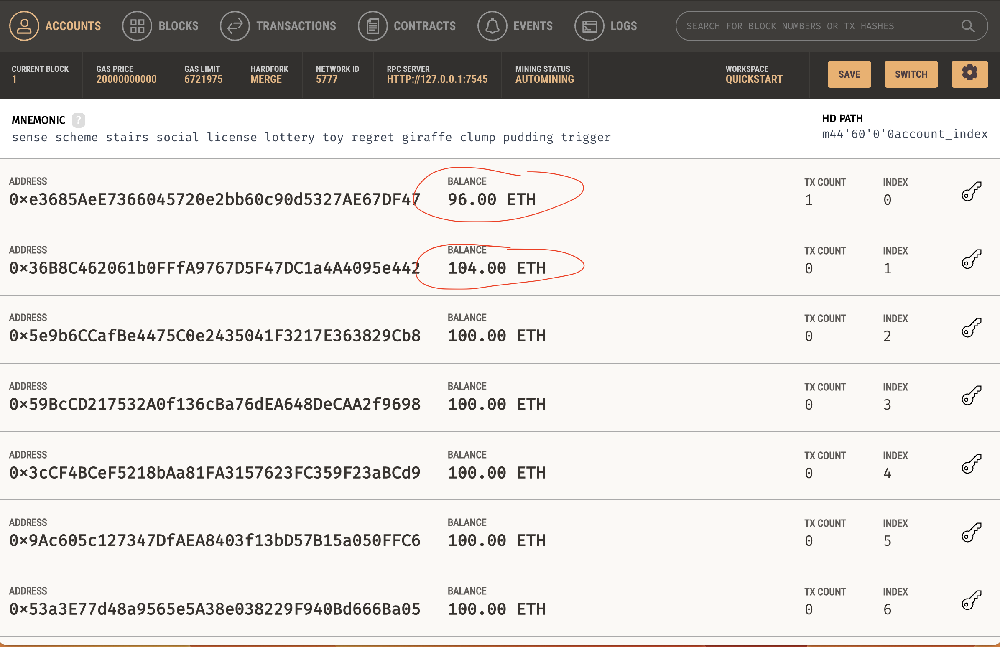
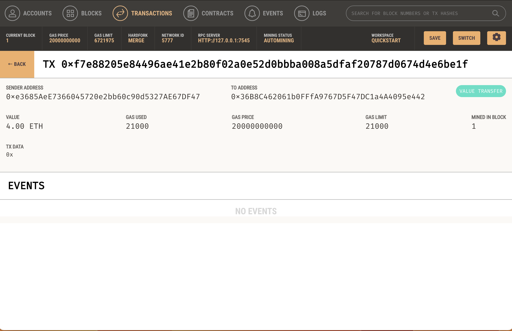

# Cryptocurrency Wallet

## Overview

KryptoJobs2Go is a revolutionary platform designed to disrupt the traditional hiring and payment processes in the fintech industry. As a leading developer at this startup, my primary goal is to integrate the Ethereum blockchain network into the application, allowing the customers to find and hire fintech professionals seamlessly while enabling instant and secure cryptocurrency payments for their services.

## Process

Specifically, I assumed the perspective of a KryptoJobs2Go customer in order to do the following:

* Generate a new Ethereum account instance by using the mnemonic seed phrase provided by Ganache.

* Fetch and display the account balance associated with your Ethereum account address.

* Calculate the total value of an Ethereum transaction, including the gas estimate, that pays a KryptoJobs2Go candidate for their work.

* Digitally sign a transaction that pays a KryptoJobs2Go candidate, and send this transaction to the Ganache blockchain.

* Review the transaction hash code associated with the validated blockchain transaction.

## Testing

Now it's time to put it all together and test the KryptoJobs2Go application with our newly integrated Ethereum wallet. I sent a test transaction by using the application’s web interface, and then look up the resulting transaction in Ganache:

1. From the terminal, navigate to the project folder that contains my `.env` file, `krypto_jobs.py` and `crypto_wallet.py` files. 

2. Launch Streamlit application.

3. On the resulting webpage, I selected a candidate, enter the number of hours that I would like to hire them for.

4. Click the Send Transaction button to sign and send the transaction with my Ethereum account information, observe the Validated Transaction Hash.

A screenshot of my address balance, as well as the recipient’s address balance and history from Ganache (I have used the second address from Ganache as the recipient on Streamlit so that it can be shown):

A screenshot of the transaction details on Ganache:

